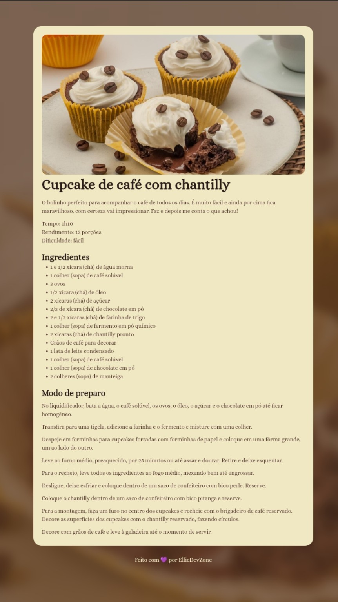

# Receita-Cupcake Projeto prático Rocketseat 🧁☕  

Projeto prático desenvolvido durante o curso de FullStack da Rocketseat, criando uma página responsiva de receita deliciosa de cupcakes de café.  

Gostei muito de aprender os atalhos que nem imaginava poder ter. 
 

## 🚀 Tecnologias  

- HTML5  
- CSS3  

## 🎨 Layout  
Figma:
 https://www.figma.com/community/file/1360315130061454535/pagina-de-receita 
